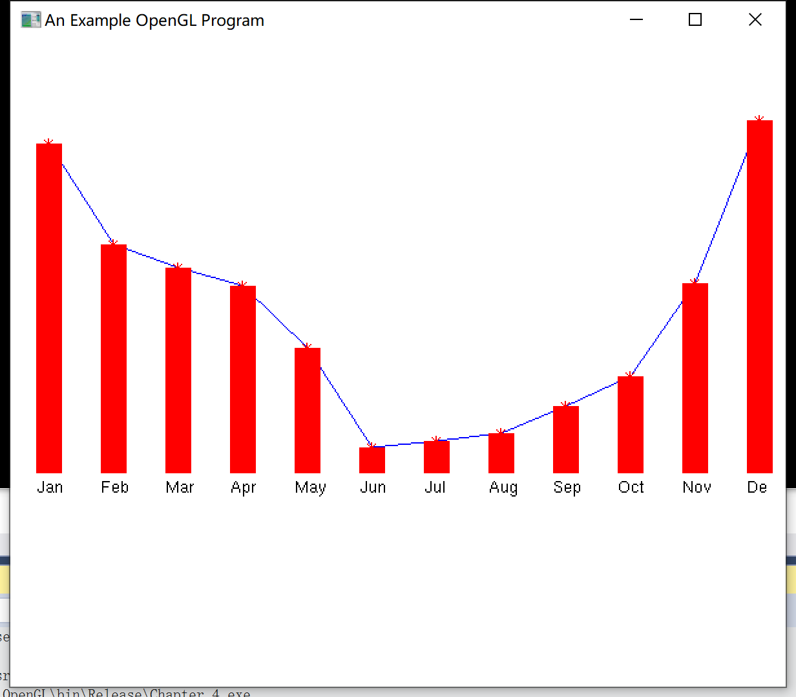
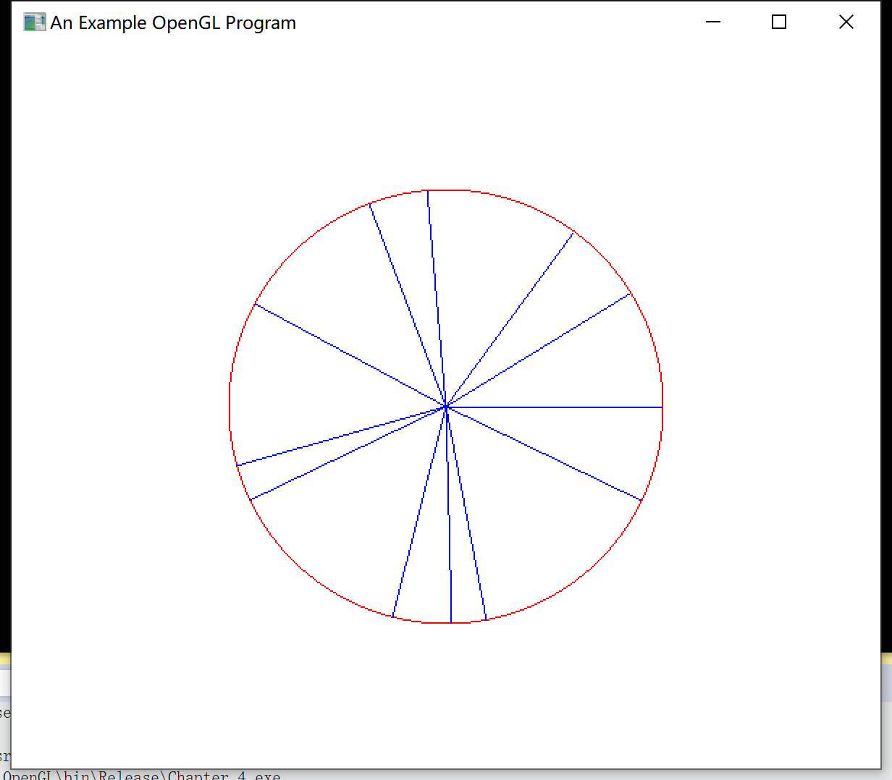
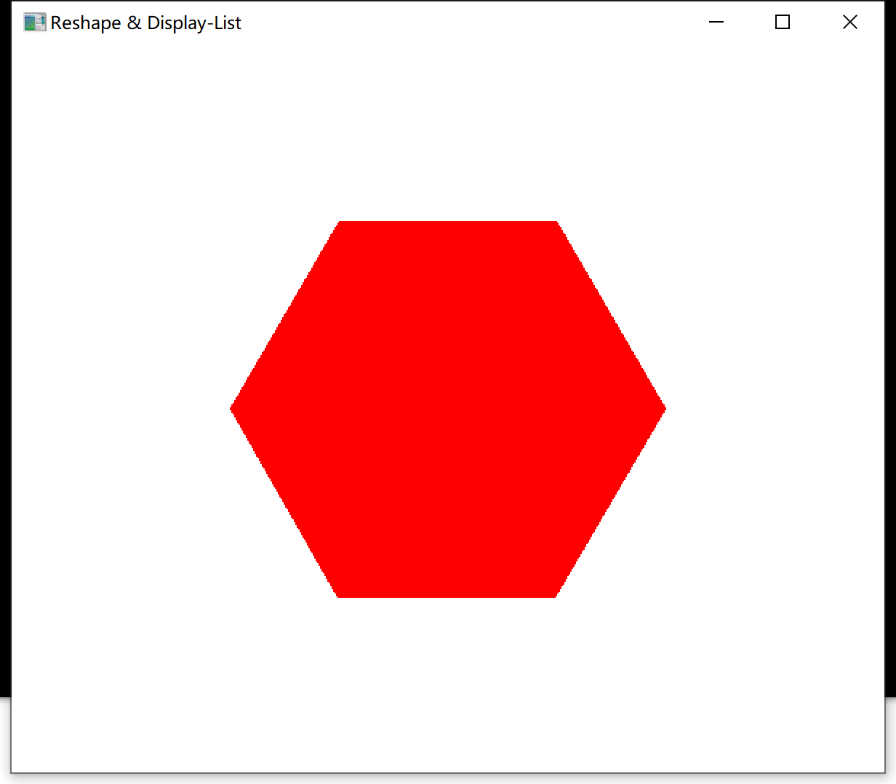

# 第4章  输出图元

屏幕坐标

opengl 画点：支持不同的数据类型的点

画线：逐条线段、折线、封闭曲线

填充：多边形填充、矩形填充

凹多边形：实别、分割

多边形内外测试、多边形表

平面方程，向前面、向后面

三角形：逐个三角形、折线三角形、扇面三角形（线段、矩形也类似）

顶点数组——快速绘制多个图形

OpenGL像素图元、位图函数

光栅操作：以某种方式处理像素阵列的操作（缓存光栅块）、字符图元、字符函数

OpenGL显示表，显示窗口重定形

## 程序内容包括：

>矩形的绘制与填充
>
>折线的绘制
>
>多边形或者圆的绘制
>
>字符的绘制
>
>显示表

